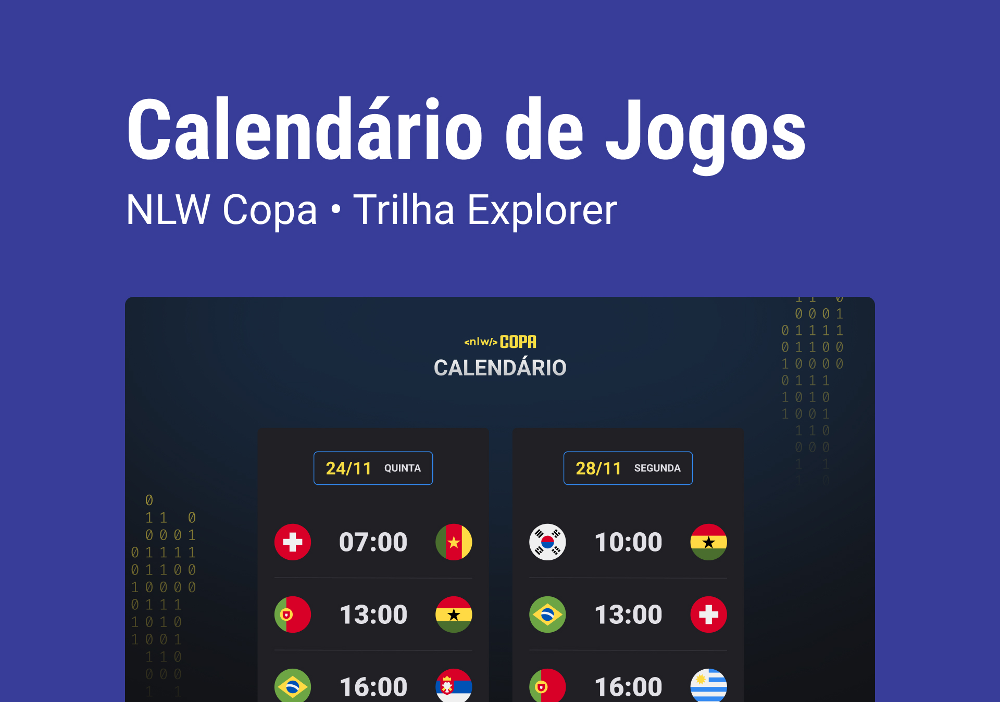

<h1 align="center"> NLW #10 Copa 2022 </h1>

Base: Evento exclusivo e gratuito, promovido pela Rocketseat para ensino de tecnologias WEB.

  <a href="#-tecnologias">Tecnologias</a>&nbsp;&nbsp;&nbsp;|&nbsp;&nbsp;&nbsp;
  <a href="#-projeto">Projeto</a>&nbsp;&nbsp;&nbsp;|&nbsp;&nbsp;&nbsp;
  <a href="#-layout">Layout</a>&nbsp;&nbsp;&nbsp;|&nbsp;&nbsp;&nbsp;
  <a href="#memo-licença">Licença</a>

  

 

  

## 🚀 Tecnologias

Esse projeto foi desenvolvido com as seguintes tecnologias:

-   HTML e CSS
-   JavaScript
-   Git e Github
-   [Imagens Randômicas](https://source.unsplash.com/random)
-   [Pesquisa: Calendário Google - Copa 2022](https://www.google.com/search?q=Calend%C3%A1rio+Google+-+Copa+2022&oq=Calend%C3%A1rio+Google+-+Copa+2022&aqs=chrome..69i57j33i160l2j33i22i29i30l7.262j0j7&sourceid=chrome&ie=UTF-8)
-   [Google Fonts](https://fonts.google.com/)
-   -   Roboto Bold (Bold-700)
-   -   Roboto Black (Black-900)

 

## 💻 Projeto

O Calendário Copa é um projeto que mostra os jogos da Copa do Mundo FIFA 2022 aplicando técnicas de @media para responsividade, formatação e animações em CSS puro.

## 🔖 Layout

Você pode visualizar o layout do projeto através [DESSE LINK](<https://www.figma.com/file/UPsYSZNvEIUjCmXAeVry45/Calend%C3%A1rio-de-Jogos-(Community)?node-id=172%3A179/duplicate>). É necessário ter conta no [Figma](https://figma.com) para acessá-lo.

## 📝 Licença

Esse projeto está sob a licença MIT.

---

Feito com ♥ by Rocketseat :wave: [Participe da nossa comunidade!](https://discord.gg/rocketseat)
